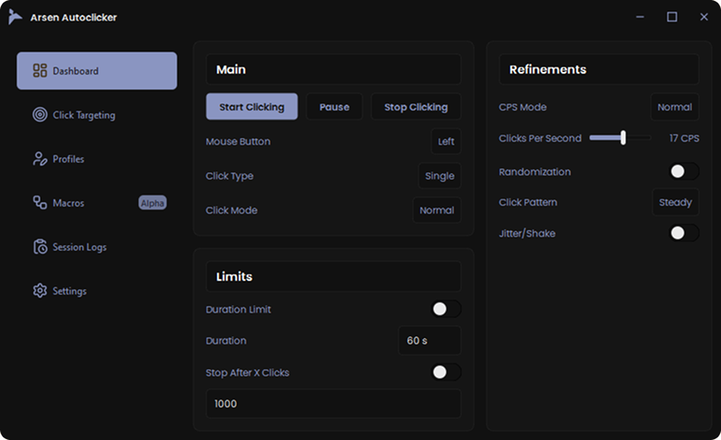
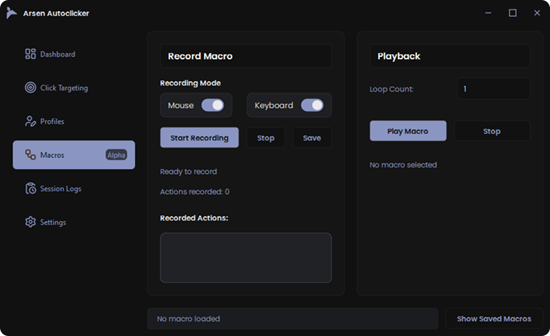

  
  &nbsp;&nbsp;&nbsp;
  

  

  
  
  
  

<h1 align="center">Arsen Autoclicker & Macro Manager</h1>

<b>Efficient automation designed for precision and clarity.</b>

---

## Overview
Arsen is a Windows automation utility built using **Python** and **PySide6**, providing a refined interface for creating, managing, and executing mouse and keyboard macros.  
It focuses on stability, accuracy, and a modern UI/UX experience suitable for developers, professionals, and productivity-oriented users.

---

## Features
- **High-Precision Automation** — Consistent and responsive macro execution  
- **Profile Management** — Create and switch between multiple macro setups  
- **Modern Interface** — Clean, minimal, and organized layout  
- **Portable Build** — Launch `Arsen.exe` directly without installation  
- **Offline Operation** — No online connectivity; no data is transmitted externally

---

## Quick Start
1. Download the latest ZIP package  
2. Extract the contents to any directory  
3. Run **Arsen.exe**  
4. Create macros and configure global hotkeys

---

## Core Tools
- **Macro Editor** — Construct and organize action sequences  
- **Global Hotkeys** — Trigger macros instantly from any application  
- **Profile System** — Switch workflows within seconds

---

## Screenshots

### Dashboard

  

### Macro Editor

  

---

## System Requirements
- Windows 10 or Windows 11 (64-bit)  
- No administrative privileges required

---

## License
**All rights reserved.**  
Arsen is proprietary software. Redistribution, modification, or reuse of its source code or assets is prohibited.  
Refer to the included `LICENSE` file for full licensing details.

---

<b>Arsen — A refined and dependable automation solution for modern workflows.</b>

